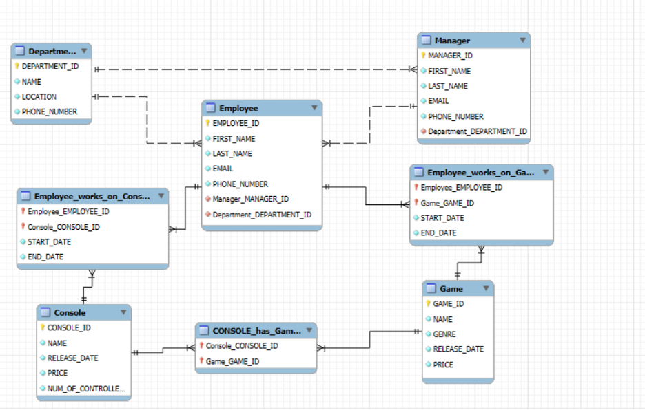

# Game Company Database Design Project

## Overview

Designed and implemented a relational database for a video game company using Oracle SQL. The database was created to manage employees, managers, departments, gaming consoles, video games, and project assignments. The project demonstrates database design, data modeling, schema implementation, data population, and SQL query development.

## Technologies Used

* Oracle SQL
* Oracle SQL Developer
* Relational Database Design
* Entity Relationship Diagrams (ERD)

## Skills Demonstrated

* Database Design
* Data Modeling
* Relational Databases
* DDL (Data Definition Language)
* DML (Data Manipulation Language)
* Primary Keys
* Foreign Keys
* Joins
* Aggregate Functions
* CASE Statements
* Data Analysis
* Query Development

## Database Components

* Department
* Manager
* Employee
* Console
* Game
* Employee_works_on_Console
* Employee_works_on_Game
* Console_has_Games

## Project Features

* Designed a normalized relational database schema
* Created tables using SQL DDL statements
* Implemented primary and foreign key constraints
* Inserted sample business data using DML
* Developed business-focused SQL queries
* Created schema objects for reporting and analysis
* Built an Entity Relationship Diagram (ERD)

## Business Questions Answered

* Which employees work in specific departments?
* Which managers supervise specific employees?
* How many employees belong to each department?
* Which games are associated with specific consoles?
* What are the most expensive consoles and games?
* How are employees assigned to gaming projects?

## Repository Structure

* Create_Tables_DDL_Part2.sql – Database schema creation
* Insert_Tables_DDL_Part3.sql – Data population scripts
* Schema_Objects.sql – Database objects and reporting components
* Query Files – Business analysis and reporting queries
* ERD.png – Entity Relationship Diagram

  ## Entity Relationship Diagram (ERD)

## Author

**Abell Gebremichael**

BBA, Management Information Systems

Skills: SQL | Oracle SQL Developer | Excel | Power BI | Tableau | Python | Data Analytics | Database Design
